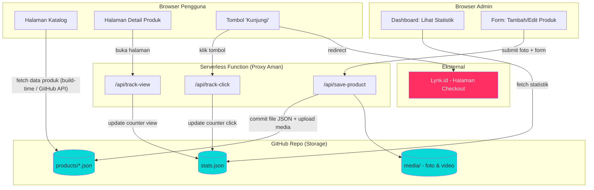
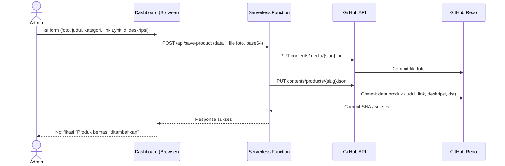
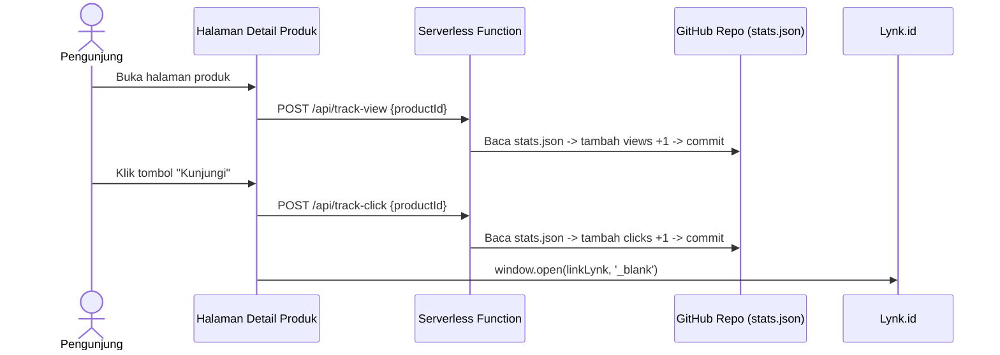

# SYS.md
## Arsitektur Sistem — Showcase Produk Digital (GitHub sebagai Storage)

### 1. Gambaran Umum
Website ini adalah aplikasi **JAMstack** (JavaScript, API, Markup) — tidak ada server/database tradisional. Semua data produk dan statistik (views/clicks) disimpan sebagai file (JSON/Markdown) **langsung di dalam GitHub repo**, lalu dibaca oleh frontend melalui GitHub API atau file statis hasil build.

Karena menulis (commit) ke GitHub repo butuh *token* rahasia yang **tidak boleh** ditaruh di kode frontend (browser), maka proses **tulis data** (tambah produk, update views/clicks) dilakukan lewat satu **Serverless Function** kecil sebagai perantara aman, bukan langsung dari browser ke GitHub.

### 2. Komponen Utama

| Komponen | Peran | Contoh Teknologi |
|---|---|---|
| **Frontend Publik** | Halaman katalog & detail produk | HTML/CSS/JS (Vite/Next.js/Astro) |
| **Dashboard Admin** | UI tambah/edit produk, lihat statistik | React/Vue + auth sederhana |
| **Serverless Function (Proxy aman)** | Menjembatani Frontend ↔ GitHub API agar token tidak terekspos | Vercel/Netlify/Cloudflare Functions |
| **GitHub Repo (sebagai "Database")** | Menyimpan `products/*.json`, `stats.json`, file media | Repo GitHub + GitHub REST API (`@octokit/rest`) |
| **GitHub Pages / Vercel/Netlify Hosting** | Hosting situs statis hasil build | GitHub Pages, atau Vercel/Netlify (gratis) |
| **Lynk.id** | Tujuan akhir redirect (checkout produk) | Eksternal, tidak dikelola sistem ini |

> Catatan paket npm yang relevan dengan ide "GitHub jadi storage":
> - `@octokit/rest` — membaca/menulis file ke repo lewat GitHub API (paling fleksibel & yang dipakai di desain ini).
> - Alternatif siap-pakai: **Decap CMS** (dulu Netlify CMS) — CMS git-based yang langsung commit konten ke repo, cocok untuk dashboard tambah produk tanpa membangun proxy sendiri.
> - `simple-git` — jika ingin operasi git dari server (kurang cocok untuk serverless, karena perlu clone repo).

### 3. Diagram Arsitektur (High-Level)



### 4. Diagram Alur Data Produk (Sequence — Tambah Produk Baru)



### 5. Diagram Alur Tracking Views & Clicks



> **Catatan teknis penting**: Setiap "click" tidak menunggu response commit selesai sebelum redirect (pakai `navigator.sendBeacon()` atau fire-and-forget fetch) agar pengalaman pengguna tidak terasa lambat saat pindah ke Lynk.id.

### 6. Struktur Folder Repo (Contoh)

```
repo-root/
├─ data/
│  ├─ products/
│  │  ├─ ebook-resep-keluarga.json
│  │  └─ template-cv-modern.json
│  └─ stats.json          ← { "ebook-resep-keluarga": { "views": 120, "clicks": 34 }, ... }
├─ media/
│  ├─ ebook-resep-keluarga/
│  │  ├─ preview.jpg
│  │  └─ galeri-1.mp4
├─ functions/              ← serverless functions
│  ├─ save-product.js
│  ├─ track-view.js
│  └─ track-click.js
├─ src/                    ← frontend (komponen, halaman)
└─ public/ (jika pakai GitHub Pages sebagai host akhir)
```

Contoh isi `products/ebook-resep-keluarga.json`:
```json
{
  "id": "ebook-resep-keluarga",
  "title": "Ebook Resep Keluarga Sehat",
  "category": "Ebook",
  "previewImage": "/media/ebook-resep-keluarga/preview.jpg",
  "description": "Kumpulan 50 resep sehat untuk keluarga...",
  "gallery": ["/media/ebook-resep-keluarga/galeri-1.mp4"],
  "lynkUrl": "https://lynk.id/namauser/ebook-resep-keluarga",
  "createdAt": "2026-06-20T10:00:00Z"
}
```

### 7. Keamanan
- Token GitHub (Personal Access Token / GitHub App) **hanya disimpan sebagai environment variable di serverless function**, tidak pernah dikirim ke browser.
- Dashboard admin dilindungi minimal dengan password tunggal/JWT sederhana sebelum bisa memanggil `/api/save-product`.
- Validasi ukuran & tipe file upload (foto/video) sebelum dikirim ke GitHub API (batas ukuran file GitHub API per request ~ beberapa MB; untuk video besar bisa dialihkan ke layanan hosting media lain jika diperlukan ke depannya).

### 8. Pertimbangan Skalabilitas
- GitHub API punya **rate limit** (umumnya 5000 request/jam dengan token autentikasi) — cukup untuk trafik kecil-menengah, tapi setiap "view" yang melakukan commit langsung bisa cepat menghabiskan limit/membuat history commit penuh "noise".
- **Rekomendasi**: untuk counter views/clicks, jangan commit langsung per klik. Gunakan salah satu strategi:
  1. **Batching**: kumpulkan event di memory/queue ringan, lalu commit gabungan tiap beberapa menit (lewat scheduled function / GitHub Actions cron).
  2. Atau ganti `stats.json` di GitHub dengan layanan counter ringan terpisah (misal Cloudflare KV/Upstash Redis) khusus untuk angka yang sering berubah, sementara data produk (yang jarang berubah) tetap di GitHub repo.
- Pilihan akhir tetap "GitHub sebagai storage" untuk **data produk** sangat cocok (jarang berubah), sedangkan untuk **counter** disarankan dievaluasi lagi saat trafik mulai ramai.

### 9. Deployment Singkat
1. Push kode ke GitHub repo.
2. Hubungkan repo ke Vercel/Netlify → auto build & deploy frontend + serverless functions.
3. Set environment variable `GITHUB_TOKEN`, `GITHUB_REPO`, `ADMIN_PASSWORD` di dashboard hosting (bukan di kode).
4. Setiap admin menambah produk → otomatis commit ke repo → frontend yang fetch data langsung dari GitHub API akan menampilkan data terbaru (atau trigger rebuild jika pakai static-site generator).
